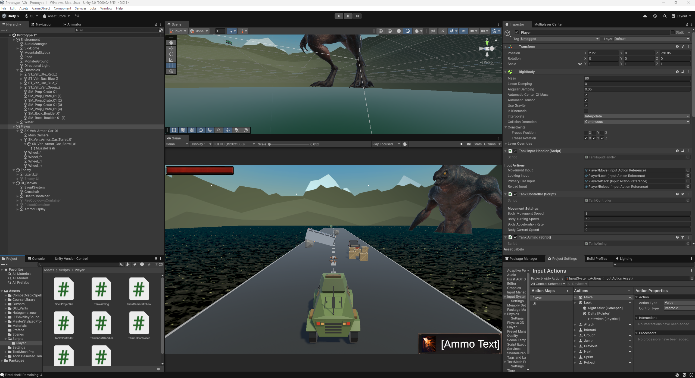

# Prototype1 (v2) – Unity "Create with Code" Project

Hello! This is the **Version 2** rebuild of *Prototype 1* from Unity's **Create with Code** course, completed as part of my continued game development education. This version showcases improved code structure, proper commenting, and project documentation. This version will highlight my growth since the original version.

## 🎮 Project Overview

**Prototype1** is a simple driving game built using Unity. The player controls a vehicle that can move forward and turn left/right while avoiding obstacles in the environment. Let's change that :).

This project demonstrates:
- Rigidbody-based movement
- Basic input handling
- Object interaction and boundaries
- Modular and readable code practices

---

## ✅ Features Completed (Stage 1)

### 🛞 Player Systems
- Modular tank movement with acceleration
- Turret and barrel aiming (mouse-based)
- Fire delay and reload system (2 seconds each)
- Infinite reserve ammo with 5-shell clip
- Projectile shell logic (in progress)

### 📊 UI Systems
- Player health bar (top-left)
- Ammo count + ammo icon (bottom-right)
- Fire cooldown bar (`Overheat…`) and reload bar (`Reloading…`)
- Dynamic display of cooldown/reload progress

### 💥 Effects & Audio
- Background music (looping)
- Muzzle flash particle effect
- Firing and impact sound placeholders
- Cursor lock and smooth camera follow (partial)

---

## 🐞 Known Issues & To-Do

- [ ] Turret & camera rotation speeds need tuning
- [ ] Wheel visuals do not spin correctly when turning in place
- [ ] Background music cuts off when firing projectiles
- [ ] Projectiles fail to instantiate properly
- [ ] Player script needs raycasting improvements
- [ ] Organize scene hierarchy for clarity

---

## 📸 Screenshots

### 🧱 Unity Editor Screenshot (as of 05.19.2025)

### 🎬 Gameplay GIF Preview (as of 05.19.2025)

---

## 🔜 Next Steps

- Finalize projectile behavior and impact effects
- Add enemy AI and health bar interaction
- Clean up the Editor hierarchy and naming
- Finalize audio

---

## 🧑‍💻 Author

**Gaetano Lehn**  
Game Developer | Unity Enthusiast  
[My LinkedIn (will be included soon)] – [My Website/Portfolio (will be included soon)]

---

## 📝 License

This project is for educational and portfolio use.
This project is license under the [MIT License](LICENSE).

Unity and the *Create with Code* curriculum © Unity Technologies.

---

## ⚠️ Asset Use Restriction

All assets included in this project are for demonstration purposes only.  
They are not licensed for reuse, redistribution, or commercial use.

Please do **not** extract or repurpose any part of this project’s assets unless you have proper authorization from the original asset creators.

